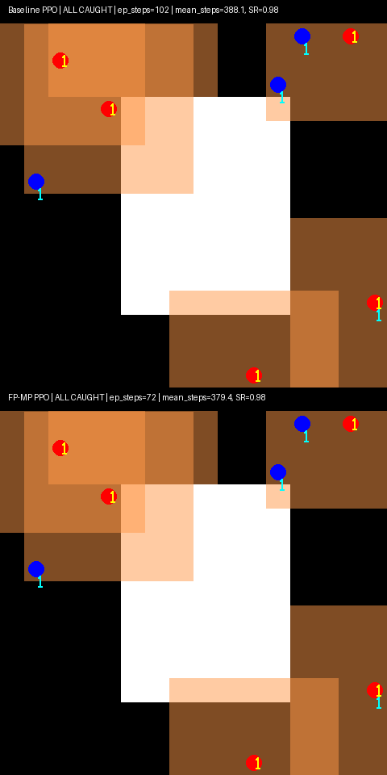

# Improving PPO-Based Pursuit Agents Using Free-Probability MP Regularization

This repository implements a reinforcement learning framework that integrates **Free Probability (FP)** and **Marchenko–Pastur (MP) spectrum shrinkage** into PPO.
The method stabilizes latent representations, suppresses harmful eigenvalue spikes, and improves multi-agent pursuit efficiency in a procedurally generated GridWorld.

---

## Features

### **1. MP-based Free-Probability Regularization**

* Computes the covariance spectrum of latent feature activations
* Estimates the theoretical MP upper bound
* Applies **soft spectral shrinkage** to outlier eigencomponents
* Provides a mathematically grounded mechanism to suppress spectral pathologies

### **2. Multi-Agent Pursuit GridWorld**

* 4 pursuers vs. 4 evaders
* Tile-based maps with obstacles
* Episode terminates when all evaders are caught or timeout triggers

### **3. Baseline PPO vs. FP-MP PPO**

The repository trains and evaluates both agents with:

* **Success rate**
* **Mean episode length**
* **Difficulty-enhanced evaluation**
* **Side-by-side pursuit demo GIF**

---

## Training Results

```
Baseline PPO
  mean_steps   = 409.0
  success_rate = 0.96

FP-MP PPO
  mean_steps   = 322.8
  success_rate = 0.94
```

FP-MP regularization yields **faster capture** without degrading stability.

---

## Demo (same initial seed)

**Baseline PPO vs FP-MP PPO (side-by-side comparison)**
FP-MP consistently captures all evaders in fewer steps.

↓ **Click to play**



```
=== Rollout Baseline PPO ===
Baseline PPO | ALL CAUGHT | ep_steps=102 | mean_steps=388.1 | SR=0.98

=== Rollout FP-MP PPO ===
FP-MP PPO    | ALL CAUGHT | ep_steps=72  | mean_steps=379.4 | SR=0.98
```

---

## Repository Structure

```
.
├── train_agents_mp.py     # PPO + FP-MP regularized training
├── demo_mp.py             # Side-by-side rollout and GIF generation
├── utils.py               # Spectral analysis, MP bound, shrinkage ops
├── envs/                  # GridWorld multi-agent environment
├── models/                # Saved PPO / FP-MP models
└── figs/                  # Spectrum plots & demo GIFs
```

---

## License

MIT © Kyouhei Ohmura